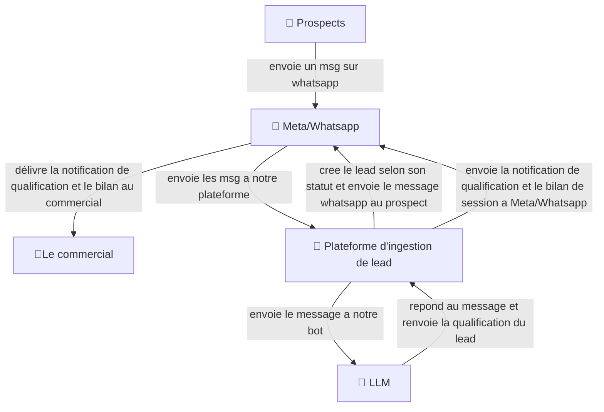

## Plateforme B2B d'ingestion, qualification IA omnicanale et routage automatique de leads

## scenario le prospect ecrit un message via whatsapp puis meta/whatsapp envoie les msg a notre plateforme (api rest) ,puis l'api envoie le message a notre bot (chatbot llm openrouter/openai/anthropic/gemini) notre bot recoit et repond aux messages entrants du prospect pour qualifier le lead , dès que le lead est qualifié il est crée selon son statut, s'il est qualifié,perdu.

## Extraction d'information on sait que dans c4 niveau 1 on doit identifier :

# les acteurs (commercial,Prospect)

## les sytemes tiers(Meta/Whatsapp, llm,)

## le systeme centrale(plateforme d'ingestion de lead)

