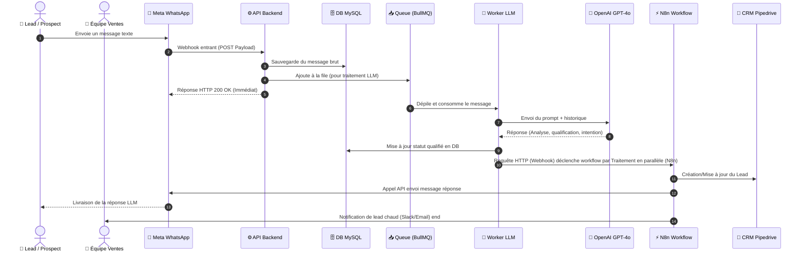

## Diagramme de séquence

```mermaid
sequenceDiagram
    autonumber
    
    %% Définition des acteurs
    actor Lead as 👤 Lead / Prospect
    actor Commercial as 👤 Équipe Ventes

    %% Systèmes externes et API (Nettoyage des crochets inutiles pour Mermaid)
    participant MetaWhatsApp as 📱 Meta WhatsApp
    participant API as ⚙️ API Backend
    participant DB as 🗄️ DB MySQL
    participant Queue as 📥 Queue (BullMQ)
    participant Worker as 🧠 Worker LLM
    participant LLM as 🤖 OpenAI GPT-4o
    participant N8n as ⚡ N8n Workflow
    participant CRM as 🏢 CRM Pipedrive
    
    %% --- PHASE 1 : INGESTION SYNCHRONE RAPIDE ---
    Lead->>MetaWhatsApp: Envoie un message texte
    MetaWhatsApp->>API: Webhook entrant (POST Payload)
    API->>DB: Sauvegarde du message brut
    API->>Queue: Ajoute à la file (pour traitement LLM)
    API-->>MetaWhatsApp: Réponse HTTP 200 OK (Immédiat)

    %% --- PHASE 2 : TRAITEMENT ASYNCHRONE ---
    Queue->>Worker: Dépile et consomme le message
    Worker->>LLM: Envoi du prompt + historique
    LLM-->>Worker: Réponse (Analyse, qualification, intention)
    Worker->>DB: Mise à jour statut qualifié en DB
    
    %% --- PHASE 3 : ORCHESTRATION MÉTIER ---
    Worker->>N8n: Requête HTTP (Webhook) déclenche workflow par Traitement en parallèle (N8n)
    
    
    N8n->>CRM: Création/Mise à jour du Lead
    N8n->>MetaWhatsApp: Appel API envoi message réponse
    MetaWhatsApp-->>Lead: Livraison de la réponse LLM
    N8n->>Commercial: Notification de lead chaud (Slack/Email) end
    


```